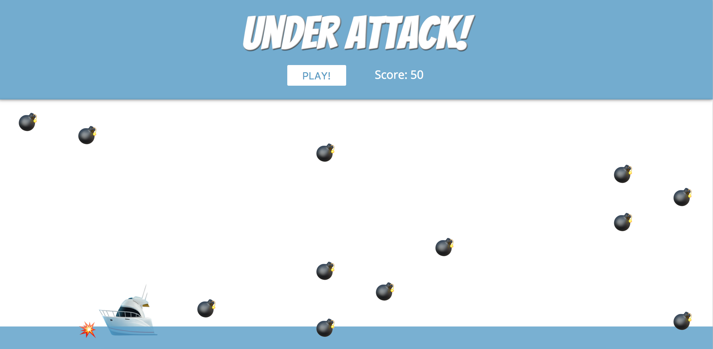
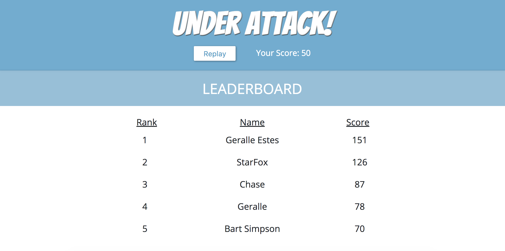
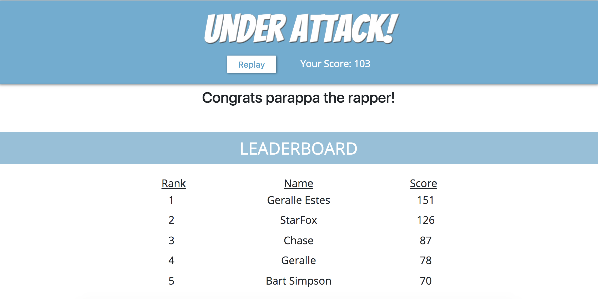
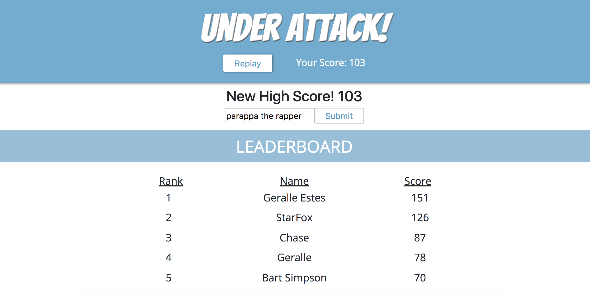

# Under Attack!

> A fun game with Emojis, Bombs, and intense competition

Demo: https://point-grabber.firebaseapp.com/

Walkthrough video: https://www.youtube.com/watch?v=YH44TNFrDRM

## Technologies
* CJ R (Galvanize) Leaderboard API
* HTML
* CSS
* JQuery
* BootStrap

## Features
* Takes players input through left and right arrow keyboard keys to avoid falling bombs
* When the game is over, the user is displayed their final score
* The top 5 high scores are fetched through the leaderboard API and displayed to the player
* If the players high scores are worthy enough to grace the leaderboard, they are greeted with a form to input their name
* The leaderboard is then refreshed to show the up-to-date changes
* After viewing the high ranked scores, the user can click the replay button for another round of fun!
